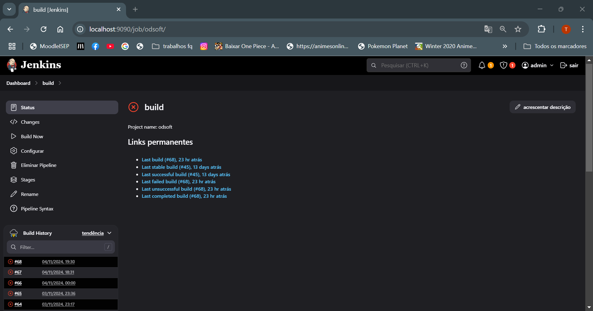

# ODSOFT24-25_1201152_1230205
Desenvolvimento do trabalho de ODSOFT 24/25

Relatório Parte 1


# Índice

- [1 Development of CI/CD pipeline](#1-development-of-cicd-pipeline)
    - [1.1 - Jenkins deployment on localhost and DEI’s remote servers](#11---jenkins-deployment-on-localhost-and-deis-remote-servers)
    - [1.2 - CI/CD pipeline stages (not only running but also description and critical analysis)](#12---cicd-pipeline-stages-not-only-running-but-also-description-and-critical-analysis)
    - [1.3 Pipeline specification read (checkout) from SCM](#13-pipeline-specification-read-checkout-from-scm)
    - [1.4 Build and Package](#14-build-and-package)
    - [1.5 Static Code Analysis](#15-static-code-analysis)
    - [1.6 Tests (by type)](#16-tests-by-type)
    - [1.7 Deployment on localhost](#17-deployment-on-localhost)
    - [1.8 Deployment on DEI's remote server (or other cloud's remote server)](#18-deployment-on-deis-remote-server-or-other-clouds-remote-server)

- [2 Improvement of Automated Functional Software Tests (including not only coverage but also quality)](#2-improvement-of-automated-functional-software-tests-including-not-only-coverage-but-also-quality)
    - [2.1 - Unit Opaque-box tests (domain classes)](#21---unit-opaque-box-tests-domain-classes)
    - [2.2 - Unit Transparent-box tests (domain classes)](#22---unit-transparent-box-tests-domain-classes)
    - [2.3 Mutation tests (domain classes)](#23-mutation-tests-domain-classes)
    - [2.4 - Integration tests (controller-service-{domain, repository, gateways, adapters})](#24---integration-tests-controller-service-domain-repository-gateways-adapters)
    - [2.5 - Acceptance tests](#25---acceptance-tests)

- [3 Documenting](#3-documenting)
    - [3.1 - System-as-is (reverse engineering design)](#31---system-as-is-reverse-engineering-design)
    - [3.2 - Requirements, especially ASR](#32---requirements-especially-asr)
    - [3.3 - Critical analysis of the pipeline, including performance, with evidence of improvement over time](#33---critical-analysis-of-the-pipeline-including-performance-with-evidence-of-improvement-over-time)


# 1 Development of CI/CD pipeline
## 1.1 - Jenkins deployment on localhost and DEI’s remote servers

# Local


# Remote


## 1.2 - CI/CD pipeline stages (not only running but also description and critical analysis)

CI/CD pipeline stages

* checkout
* Unit tests
* Mutation Tests
* Integracion tests
* Deploy

-- To add --
*Acceptence* and *Smoke*


| Etapa                     | Descrição                                                                                         | Análise Crítica                                                                                                            |
|---------------------------|---------------------------------------------------------------------------------------------------|---------------------------------------------------------------------------------------------------------------------------|
| **Checkout**              | O código-fonte é extraído do repositório Git.                                                   | Garante que a versão mais recente do código esteja disponível. Falhas nesta fase impedem a execução das etapas seguintes. |
| **Instalação de Dependências** | Instala ferramentas necessárias como Git e Maven, verificando se já estão presentes.         | Configuração do ambiente de construção. Evita instalações desnecessárias, economizando tempo e recursos.                  |
| **Execução de Testes Unitários**  | Executa testes unitários para verificar a funcionalidade dos componentes individuais.          | Fundamental para garantir que cada parte do código funcione conforme esperado. Falhas indicam problemas a serem resolvidos. |
| **Execução de Testes de Integração** | Realiza testes que avaliam a interação entre diferentes módulos do sistema.                   | Importante para identificar problemas que não aparecem em testes unitários. Garante que os módulos funcionem corretamente em conjunto. |
| **Build e Package**      | Compila o código e empacota o aplicativo em um arquivo executável, como um JAR.                 | Etapa crítica que garante que o código esteja pronto para produção. Erros aqui podem resultar em um aplicativo não executável. |
| **Deploy**                | Realiza a implantação do aplicativo em um ambiente de produção, iniciando a aplicação.          | A implantação deve ser feita com cautela para evitar interrupções. Mecanismos de rollback são recomendados em caso de falhas. |
| **Smoke Tests**           | Realiza testes básicos após a implantação para verificar funcionalidades principais.              | Primeira verificação de estabilidade da aplicação após a implantação. Importante para identificar problemas antes de testes mais profundos. |


## 1.3 Pipeline specification read (checkout) from SCM

Na especificação da pipeline, a etapa de "Checkout" é crucial, pois é onde o código-fonte é obtido do sistema de controle de versão (SCM). Abaixo está uma análise detalhada desta etapa, incluindo a sua estrutura e importância:

```java
stages {
    stage('Check Out') {
        steps {
            script {
                echo 'Starting Check Out stage...'
                git url: 'https://github.com/RitaPinto1230205/ODSOFT24-25_1201152_1230205.git', branch: 'main'
            }
        }
    }
} 
```
    Estrutura da Etapa de Checkout
    
   *  (stage('Check Out')): Define um novo estágio na pipeline chamado "Check Out". Os estágios permitem que a pipeline seja organizada em diferentes fases, facilitando a leitura e a manutenção do código.
   *  (steps): Esta seção contém as ações que devem ser executadas durante o estágio. Neste caso, estamos executando um script.
   *  (script): Um bloco que permite que comandos mais complexos sejam executados. Isso é útil quando há necessidade de lógica condicional ou operações mais elaboradas.
   *  (echo 'Starting Check Out stage...'): Um comando que imprime uma mensagem no console para informar que a etapa de checkout começou. Isso é útil para o rastreamento e a depuração da execução da pipeline.
   *  (git url: '...'): Este comando é responsável por clonar o repositório Git especificado. Ele busca o código-fonte na URL fornecida e na branch especificada (neste caso, main).
   * O uso do Git permite que a equipe trabalhe em colaboração, garantindo que todos os desenvolvedores estejam sempre com a versão mais recente do código. 


   * Importância da Etapa de Checkout
    Obtenção do Código: O checkout é a primeira etapa na maioria das pipelines CI/CD, pois sem o código-fonte, não há nada para construir ou testar. Esta etapa assegura que a versão correta do código está sendo utilizada.
    Versionamento: Permite que a pipeline trabalhe com a versão mais atual do código, o que é fundamental para um desenvolvimento ágil e colaborativo. Isso reduz o risco de conflitos e inconsistências no código.
    Transparência: A mensagem de echo proporciona visibilidade durante a execução da pipeline, permitindo que os desenvolvedores acompanhem o progresso e identifiquem rapidamente onde ocorreram problemas, se houver.
    Integração: O uso do SCM, como o Git, permite integrar facilmente outras ferramentas e serviços, como pull requests, revisões de código e gestão de branches.


## 1.4 Build and Package

A etapa "Build and Package" é essencial na pipeline de integração contínua e entrega contínua (CI/CD). Nesta fase, o código-fonte do projeto é compilado e empacotado em um formato que pode ser facilmente implantado. O Maven, como ferramenta de gerenciamento de projetos e automação de construção, é utilizado para realizar essas tarefas.

```java
stage('Build and Package') {
    steps {
        script {
            dir(env.PROJECT_DIR) {
                if (fileExists('pom.xml')) {
                    echo 'Building and packaging project...'
                    if (isUnix()) {
                        sh 'mvn clean package'
                    } else {
                        bat 'mvn clean package'
                    }
                } else {
                    error 'pom.xml not found. Aborting.'
                }
            }
        }
    }
}
```

* Definição do Estágio (stage('Build and Package')):
        Esta é a fase onde o código é construído e empacotado. Ela assegura que todas as dependências são resolvidas e que o código está pronto para ser executado.
  * Passos (steps):
          Contém as ações que serão executadas durante esta fase.
  * Script (script):
          Um bloco que permite executar comandos de script mais complexos. Isso é útil para manipulações mais avançadas e para adicionar lógica condicional.
  *  Alterar Diretório (dir(env.PROJECT_DIR)):
          Muda para o diretório do projeto definido na variável de ambiente PROJECT_DIR. Isso é crucial para garantir que os comandos subsequentes sejam executados no contexto correto do projeto. 
  * Verificação do pom.xml:
          Antes de iniciar a construção, há uma verificação para garantir que o arquivo pom.xml está presente no diretório do projeto. Este arquivo é fundamental para o Maven, pois contém as configurações do projeto, incluindo suas dependências e plugins. Se o arquivo não for encontrado, a execução é abortada com uma mensagem de erro. 
  * Construção e Empacotamento (mvn clean package):
          O comando mvn clean package é executado, que realiza duas tarefas principais: 
  * clean: Remove os arquivos gerados em construções anteriores, garantindo que não haja conflitos com artefatos antigos.
          package: Compila o código-fonte e empacota o projeto em um artefato (geralmente um arquivo JAR ou WAR), que será utilizado nas etapas posteriores da pipeline.

      Importância da Etapa Build and Package
          Deteção Precoce de Erros:
          Durante esta fase, o código é verificado para erros de compilação e problemas de dependência. Isso ajuda a garantir que somente código funcional seja enviado para as etapas seguintes, como testes e deploy.
          Geração de Artefactos:
          Os artefactos gerados durante esta fase são essenciais para a implantação e podem ser utilizados em ambientes de desenvolvimento, teste ou produção.
          Facilidade de Implantação:
          Ao empacotar o código em um formato padrão, facilita-se a implantação em diferentes ambientes.
          Preparação para Testes:
          Após a construção, os artefactos podem ser submetidos a testes automatizados, assegurando que a funcionalidade do código está conforme esperado.
         

# 1.5 Static Code Analysis + code coverage 
SonarCube and sonarcubecloud


## 1. Segurança
- **Classificação**: A
- **Problemas Abertos**: 0
- O projeto não apresenta problemas de segurança, o que indica que o código está seguro de acordo com a análise estática.

## 2. Confiabilidade
- **Classificação**: D
- **Problemas Abertos**: 9
- Existem 9 problemas de confiabilidade no código. A classificação "D" sugere que há problemas que devem ser corrigidos para melhorar a estabilidade e fiabilidade do sistema.

## 3. Manutenibilidade
- **Classificação**: A
- **Problemas Abertos**: 342
- São identificados 342 problemas de manutenibilidade, também conhecidos como "code smells". Embora estes problemas não causem erros diretos, podem dificultar a leitura e manutenção do código a longo prazo.

## 4. Cobertura de Testes
- **Cobertura**: 17.4%
- **Linhas para Cobrir**: 2.5k
- Apenas 17.4% do código está coberto por testes, o que é considerado baixo. Aumentar a cobertura é essencial para reduzir o risco de falhas e garantir que o código foi bem testado.

## 5. Duplicação de Código
- **Percentagem de Duplicação**: 0.9%
- **Linhas de Código**: 9.3k
- A duplicação do código é de 0.9%, o que é relativamente baixo. Percentagens altas de duplicação aumentam a complexidade de manutenção e podem indicar má qualidade do código.

## 6. Hotspots de Segurança
- **Hotspots de Segurança**: 3
- Os "Security Hotspots" são áreas do código que requerem uma revisão de segurança, embora não sejam falhas de segurança confirmadas. Estas áreas devem ser inspecionadas para garantir a segurança do sistema.

## 7. Qualidade Geral do Código
- **Quality Gate**: Reprovado (1 falha)
- A análise do "Quality Gate" falhou devido a pelo menos um dos critérios de qualidade definidos. Este alerta pode estar relacionado com a baixa cobertura de testes, problemas de confiabilidade ou outra métrica que não atingiu o nível necessário.


## Test Coverage 

*First*


*Last*


# 1.7 Tests (by type)

 - Testes unitários ✅
 - Testes de integração ✅
 - Testes de mutação ✅
 - Testes de aceitação ✅
 - Tentativa de SmokeTest ✅ -> SmokeTest.html

# 1.8 Deployment on localhost




# 1.9 Deployment on DEI's remote server (or other cloud's remote server)


## 2 Improvement of Automated Functional Software Tests (including not only coverage but also quality)

# 2.1 - Unit Opaque-box tests (domain classes)
    AuthorTest
| Nome do Teste                                                  | Tipo     | Descrição                                                                                       |
|---------------------------------------------------------------|----------|-------------------------------------------------------------------------------------------------|
| `ensureNameNotNull`                                          | Unitário | Garante que o nome do autor não pode ser nulo, lançando uma `IllegalArgumentException`.        |
| `ensureBioNotNull`                                           | Unitário | Garante que a biografia do autor não pode ser nula, lançando uma `IllegalArgumentException`.   |
| `whenVersionIsStaleItIsNotPossibleToPatch`                   | Unitário | Verifica se uma tentativa de aplicar um patch com uma versão obsoleta lança uma exceção.       |
| `testCreateAuthorWithoutPhoto`                               | Unitário | Verifica a criação de um autor sem foto, assegurando que a foto é nula.                      |
| `testCreateAuthorRequestWithPhoto`                           | Unitário | Verifica a criação de um autor a partir de uma requisição, confirmando que a foto é atribuída. |
| `testCreateAuthorRequestWithoutPhoto`                        | Unitário | Verifica a criação de um autor a partir de uma requisição sem foto, assegurando que a foto é nula. |
| `testEntityWithPhotoSetPhotoInternalWithValidURI`           | Unitário | Verifica se a foto é definida corretamente ao usar um URI válido.                             |
| `ensurePhotoCanBeNull_AkaOptional`                           | Unitário | Verifica que o autor pode ser criado com uma foto nula.                                       |
| `ensureValidPhoto`                                           | Unitário | Garante que um autor com foto válida retorna um objeto `Photo` corretamente.                   |

    AuthorTestBB
| Nome do Teste                                    | Tipo     | Descrição                                                                                       |
|-------------------------------------------------|----------|-------------------------------------------------------------------------------------------------|
| `ensureNameCannotBeNull`                         | Unitário | Garante que o nome do autor não pode ser nulo, lançando uma `IllegalArgumentException`.        |
| `ensureBioCannotBeNull`                          | Unitário | Garante que a biografia do autor não pode ser nula, lançando uma `IllegalArgumentException`.   |
| `ensureValidAuthorCreation`                      | Unitário | Verifica se um autor é criado corretamente com um nome e biografia válidos, assegurando que a foto é nula. |
| `whenVersionIsStale_applyPatchThrowsStaleObjectStateException` | Unitário | Verifica se uma versão obsoleta ao aplicar um patch lança a exceção correta.                   |


    BioTest
| Nome do Teste                                    | Tipo     | Descrição                                                                                       |
|-------------------------------------------------|----------|-------------------------------------------------------------------------------------------------|
| `ensureBioMustNotBeNull`                        | Unitário | Garante que a biografia não pode ser nula, lançando uma `IllegalArgumentException`.           |
| `ensureBioMustNotBeBlank`                       | Unitário | Garante que a biografia não pode ser uma string vazia, lançando uma `IllegalArgumentException`.|
| `ensureBioMustNotBeOversize`                   | Unitário | Verifica se a biografia não excede o comprimento máximo permitido, lançando uma exceção se exceder. |
| `ensureBioIsSet`                                | Unitário | Verifica se a biografia é definida corretamente ao ser criada, comparando o valor esperado.    |
| `ensureBioIsChanged`                            | Unitário | Verifica se a biografia pode ser alterada corretamente e se o novo valor é o esperado.        |
| `testBioSanitization`                           | Unitário | Garante que tags HTML e de script são removidas da biografia, permitindo apenas conteúdo válido.|
| `testBioBoundaryValueAtMaxLength`              | Unitário | Testa a criação de uma biografia com exatamente 4096 caracteres, verificando se é aceita.     |
| `testBioExceedingMaxLength`                    | Unitário | Verifica se a criação de uma biografia com 4097 caracteres lança uma `IllegalArgumentException`.|
| `testBioWithSpecialCharacters`                  | Unitário | Garante que caracteres especiais não são aceitos na biografia, resultando em uma string diferente. |
| `testBioWithOnlyWhitespace`                     | Unitário | Verifica que uma biografia composta apenas por espaços em branco lança uma `IllegalArgumentException`. |


    BookTest
| Nome do Teste                                     | Tipo     | Descrição                                                                                                 |
|--------------------------------------------------|----------|-----------------------------------------------------------------------------------------------------------|
| `ensureIsbnNotNull`                              | Unitário | Verifica se o ISBN não pode ser nulo ao criar um novo livro.                                            |
| `ensureTitleNotNull`                             | Unitário | Garante que o título não pode ser nulo ao criar um novo livro.                                          |
| `ensureGenreNotNull`                             | Unitário | Assegura que o gênero não pode ser nulo ao criar um novo livro.                                         |
| `ensureAuthorsNotNull`                           | Unitário | Verifica se a lista de autores não pode ser nula ao criar um novo livro.                                 |
| `ensureAuthorsNotEmpty`                          | Unitário | Garante que a lista de autores não pode estar vazia ao criar um novo livro.                              |
| `ensureBookCreatedWithMultipleAuthors`           | Unitário | Testa se um livro pode ser criado com múltiplos autores sem exceções.                                    |
| `testDuplicateAuthorsAllowed`                     | Unitário | Verifica se a criação de um livro com autores duplicados é permitida.                                    |
| `testMaxLengthTitle`                             | Unitário | Garante que um título com comprimento máximo é aceito na criação de um livro.                            |
| `testExceedingMaxLengthTitle`                   | Unitário | Assegura que um título que excede o comprimento máximo lança uma `IllegalArgumentException`.              |
| `testValidBookCreation`                          | Unitário | Verifica se um livro é criado corretamente com valores válidos para todos os campos.                     |
| `testInvalidIsbn`                                | Unitário | Garante que um ISBN inválido lança uma `IllegalArgumentException` ao criar um livro.                     |


    DescriptionTest
| Nome do Teste                                    | Tipo     | Descrição                                                                                      |
|-------------------------------------------------|----------|-----------------------------------------------------------------------------------------------|
| `ensureDescriptionCanBeNull`                    | Unitário | Verifica que a descrição pode ser nula sem lançar exceção.                                   |
| `ensureDescriptionMustNotBeOversize`            | Unitário | Garante que descrições que excedem o tamanho máximo (4096 caracteres) lançam uma exceção.   |
| `ensureDescriptionIsSet`                        | Unitário | Verifica se a descrição é retornada corretamente após a sua definição.                       |
| `ensureDescriptionIsChanged`                    | Unitário | Assegura que uma descrição pode ser alterada após sua definição.                             |
| `testEmptyDescriptionIsSetToNull`              | Unitário | Verifica que uma descrição vazia é tratada como nula.                                       |
| `testWhitespaceDescriptionIsSetToNull`         | Unitário | Garante que uma descrição contendo apenas espaços em branco é tratada como nula.            |
| `testDescriptionBoundaryValueAtMaxLength`      | Unitário | Testa se uma descrição com 4096 caracteres é aceita e retornada corretamente.                |
| `testDescriptionExceedingMaxLength`            | Unitário | Verifica se uma descrição com mais de 4096 caracteres lança a exceção apropriada.           |
| `testHtmlSanitizationInDescription`            | Unitário | Garante que HTML é removido e a descrição correta é retornada.                                |
| `testSpecialCharactersInDescription`            | Unitário | Verifica se a descrição lida corretamente com caracteres especiais e não retorna o mesmo valor. |
| `testSetDescriptionToNull`                      | Unitário | Assegura que a descrição interna se torna nula quando definida como nula.                   |
| `testSetSameDescription`                        | Unitário | Garante que a descrição não muda quando o mesmo valor é definido.                           |
| `testChangeDescription`                          | Unitário | Verifica se a descrição é atualizada corretamente após a alteração.                          |
| `testSetDescriptionNullDirectly`                | Unitário | Garante que o campo interno da descrição se torna nulo ao ser definido como nulo.            |
| `testSetDescriptionWithLengthExceedingMax`    | Unitário | Garante que uma descrição muito longa lança a exceção correta.                               |
| `testSetValidDescription`                        | Unitário | Verifica que a descrição interna é válida após a definição.                                   |
| `testSanitizeHtmlCall`                          | Unitário | Assegura que a descrição retornada não contém HTML.                                          |


    IsbnTest
| Nome do Teste                                    | Tipo     | Descrição                                                                                      |
|-------------------------------------------------|----------|-----------------------------------------------------------------------------------------------|
| `ensureIsbnMustNotBeNull`                       | Unitário | Verifica que o ISBN não pode ser nulo e lança uma exceção se for.                            |
| `ensureIsbnMustNotBeBlank`                      | Unitário | Assegura que o ISBN não pode ser uma string vazia, lançando uma exceção.                    |
| `ensureIsbnMustNotBeOversize`                   | Unitário | Garante que um ISBN que excede o tamanho máximo lança uma exceção.                           |
| `ensureIsbn13IsSet`                             | Unitário | Verifica se um ISBN-13 válido é definido e retornado corretamente.                           |
| `ensureChecksum13IsCorrect`                     | Unitário | Testa se o checksum de um ISBN-13 é válido, lançando uma exceção se não for.                |
| `ensureIsbn10IsSet`                             | Unitário | Verifica se um ISBN-10 válido é definido e retornado corretamente.                           |
| `ensureChecksum10IsCorrect`                     | Unitário | Garante que um ISBN-10 com um checksum incorreto lança uma exceção.                          |
| `testHyphenatedIsbnShouldFail`                 | Unitário | Assegura que um ISBN com hífens lança uma exceção.                                          |
| `testIsbnWithSpecialCharactersShouldFail`       | Unitário | Garante que um ISBN contendo caracteres especiais lança uma exceção.                          |
| `testInvalidIsbnLength`                         | Unitário | Verifica se um ISBN com comprimento inválido lança exceções apropriadas.                     |


    TitleTest
| Nome do Teste                                     | Tipo     | Descrição                                                                                          |
|--------------------------------------------------|----------|----------------------------------------------------------------------------------------------------|
| `ensureTitleIsSet`                               | Unitário | Garante que um título é corretamente inicializado.                                                |
| `ensureTitleIsChanged`                           | Unitário | Verifica que o título pode ser alterado e reflete o novo valor.                                   |
| `testTitleBoundaryValueAtMaxLength`             | Unitário | Testa um título exatamente com 128 caracteres.                                                  |
| `testCaseSensitivityInTitle`                     | Unitário | Garante que a sensibilidade a maiúsculas e minúsculas é mantida nos títulos.                     |
| `testTitleWithNewlineCharacter`                  | Unitário | Garante que títulos com nova linha no final são tratados corretamente.                             |
| `testTitleWithTabCharacter`                      | Unitário | Garante que títulos com tabulação no final são tratados corretamente.                              |
| `testToStringWithLeadingAndTrailingWhitespace`   | Unitário | Verifica que `toString` remove espaços em branco ao redor do título.                             |
| `ensureTitleThrowsExceptionWhenExceedsMaxLength`| Unitário | Garante que um título excedendo 128 caracteres lança uma exceção.                                 |


    GenreTest
| Nome do Teste                                   | Tipo     | Descrição                                                                                          |
|------------------------------------------------|----------|----------------------------------------------------------------------------------------------------|
| `ensureGenreMustNotBeNull`                     | Unitário | Verifica que um gênero `null` lança `IllegalArgumentException`.                                    |
| `ensureGenreMustNotBeBlank`                    | Unitário | Verifica que um gênero vazio lança `IllegalArgumentException`.                                     |
| `ensureGenreMustNotBeOversize`                 | Unitário | Garante que um gênero que excede o tamanho máximo lança uma exceção.                             |
| `testGenreWithSpecialCharacters`               | Unitário | Verifica se um gênero com caracteres especiais é tratado corretamente.                             |
| `testWhitespaceTrimmingInGenre`                | Unitário | Garante que espaços em branco ao redor do gênero são removidos corretamente.                     |
| `testDuplicateGenreNamesEnforced`              | Unitário | Garante que nomes de gênero duplicados não são permitidos.                                        |
| `testGenreWithOnlyWhitespaceCharacters`        | Unitário | Verifica se um gênero contendo apenas espaços em branco lança uma exceção.                        |
| `testGenreWithLeadingAndTrailingSpaces`        | Unitário | Verifica que espaços ao redor do gênero são removidos ao definir o nome do gênero.               |
| `ensureExceptionTypeForNullGenre`              | Unitário | Garante que a mensagem de exceção para um gênero nulo é específica.                               |
| `ensureExceptionTypeForBlankGenre`             | Unitário | Garante que a mensagem de exceção para um gênero em branco é específica.                          |


    LendingNumberTest
| Nome do Teste                                     | Tipo     | Descrição                                                                                          |
|--------------------------------------------------|----------|----------------------------------------------------------------------------------------------------|
| `ensureLendingNumberNotNull`                     | Unitário | Verifica que um número de empréstimo `null` lança `IllegalArgumentException`.                     |
| `ensureLendingNumberNotBlank`                    | Unitário | Verifica que um número de empréstimo vazio lança `IllegalArgumentException`.                      |
| `ensureLendingNumberNotWrongFormat`              | Unitário | Garante que números de empréstimo em formatos incorretos lançam exceção.                          |
| `ensureLendingNumberWithoutSlashThrowsException` | Unitário | Verifica que um formato incorreto sem barra lança `IllegalArgumentException`.                     |
| `ensureLendingNumberParsingWithWrongFormatThrowsException` | Unitário | Garante que um número de empréstimo em formato incorreto lança exceção.                           |
| `ensureNegativeYearThrowsException`              | Unitário | Garante que um número de empréstimo com ano negativo lança `IllegalArgumentException`.            |
| `ensureZeroSequentialIsValid`                     | Unitário | Verifica que um número de empréstimo com sequência igual a zero é aceito.                        |


    LendingTest
| Nome do Teste                                          | Tipo     | Descrição                                                                                             |
|-------------------------------------------------------|----------|-------------------------------------------------------------------------------------------------------|
| `ensureBookNotNull`                                  | Unitário | Verifica que um objeto `Lending` com livro `null` lança `IllegalArgumentException`.                  |
| `ensureReaderNotNull`                                | Unitário | Verifica que um objeto `Lending` com leitor `null` lança `IllegalArgumentException`.                 |
| `ensureValidReaderNumber`                            | Unitário | Verifica que um número de leitor inválido (negativo) lança `IllegalArgumentException`.                |
| `testConstructorWithNullValues`                      | Unitário | Garante que o construtor do `Lending` lança exceção quando passado um livro ou leitor nulo.         |
| `ensureNoFineIfReturnedOnLimitDate`                 | Unitário | Garante que não haja multa se o livro for devolvido na data limite.                                 |
| `ensureVersioningPreventsStaleObjectModification`    | Unitário | Garante que a modificação de um objeto stale lança `IllegalArgumentException` devido ao controle de versão. |

    BirthdateDateTest| Nome do Teste                                          | Tipo     | Descrição                                                                                             |
|-------------------------------------------------------|----------|-------------------------------------------------------------------------------------------------------|
| `ensureBirthDateCanBeCreatedWithValidDate`          | Unitário | Verifica que um objeto `BirthDate` pode ser criado com uma data válida.                             |
| `ensureBirthDateCanBeCreatedWithValidStringDate`    | Unitário | Verifica que um objeto `BirthDate` pode ser criado a partir de uma string representando uma data válida. |
| `ensureExceptionIsThrownForInvalidStringDateFormat`  | Unitário | Garante que uma string com formato de data inválido lança `IllegalArgumentException`.                 |
| `ensureLeapYearDateIsValid`                           | Unitário | Verifica que uma data de 29 de fevereiro em um ano bissexto é válida.                               |
| `ensureNonLeapYearDateIsInvalid`                     | Unitário | Garante que uma data de 29 de fevereiro em um ano não bissexto lança `DateTimeException`.            |
| `ensureExactMinimumAgeIsAllowed`                     | Unitário | Verifica que uma data de nascimento que corresponde à idade mínima é válida.                         |
| `ensureBirthDateGetterReturnsCorrectValue`           | Unitário | Garante que o getter da data de nascimento retorna o valor correto.                                   |
| `ensureNullStringDateThrowsException`                 | Unitário | Verifica que passar uma string `null` para o construtor lança `NullPointerException`.                |
| `ensureEmptyStringDateThrowsException`                | Unitário | Garante que passar uma string vazia para o construtor lança `IllegalArgumentException`.              |
| `ensureWhitespaceStringDateThrowsException`           | Unitário | Verifica que passar uma string com espaços em branco para o construtor lança `IllegalArgumentException`. |
| `ensureInvalidYearInStringThrowsException`            | Unitário | Garante que passar uma string com um ano não numérico lança `IllegalArgumentException`.              |
| `ensureValidBirthDateRange`                           | Unitário | Verifica que uma data de nascimento válida dentro do intervalo é aceita.                             |
| `ensureNonNumericStringThrowsException`               | Unitário | Garante que uma string não numérica lança `IllegalArgumentException`.                                 |
| `ensureInequalityWithDifferentDate`                   | Unitário | Verifica que duas instâncias de `BirthDate` com datas diferentes não são iguais.                    |

    PhoneNumberTest
| Nome do Teste                                         | Tipo     | Descrição                                                                                                 |
|------------------------------------------------------|----------|-----------------------------------------------------------------------------------------------------------|
| `ensureValidMobilePhoneNumberIsAccepted`             | Unitário | Verifica que um número de telefone celular válido é aceito.                                              |
| `ensureValidFixedPhoneNumberIsAccepted`              | Unitário | Verifica que um número de telefone fixo válido é aceito.                                                |
| `ensureInvalidPhoneNumberThrowsException`            | Unitário | Garante que números de telefone inválidos lançam `IllegalArgumentException`.                              |
| `ensureCorrectStringRepresentation`                  | Unitário | Verifica que a representação em string de um número de telefone está correta.                           |
| `ensurePhoneNumbersWithSpecialCharactersAreRejected` | Parametrizado | Garante que números de telefone com caracteres especiais são rejeitados.                                |
| `ensureDefaultConstructorCreatesValidObject`         | Unitário | Verifica que o construtor padrão cria um objeto válido.                                                  |
| `ensureBoundaryPhoneNumbersAreAccepted`              | Parametrizado | Garante que números de telefone nos limites válidos são aceitos.                                        |
| `ensureObjectCreationWithoutNumberThrowsException`   | Unitário | Garante que a criação de um número de telefone sem número lança `NullPointerException`.                  |
| `ensurePerformanceWithMultipleValidations`           | Unitário | Testa a performance da validação com múltiplas verificações de números válidos.                          |
| `ensurePhoneNumberComparison`                         | Unitário | Verifica a comparação entre um número de telefone e um objeto que não é um número de telefone.           |
| `ensurePhoneNumbersStartingWithInvalidDigitsAreRejected` | Parametrizado | Garante que números de telefone começando com dígitos inválidos são rejeitados.                        |
| `ensurePhoneNumbersWithSpacesAreRejected`            | Parametrizado | Garante que números de telefone com espaços são rejeitados.                                              |
| `ensureToStringReturnsCorrectValue`                  | Unitário | Verifica que o método `toString` retorna o valor correto.                                               |
| `ensureDefaultConstructorWorks`                       | Unitário | Garante que o construtor padrão funciona e que o número é nulo inicialmente.                             |
| `ensurePhoneNumberComparisonWithNonPhoneNumber`      | Unitário | Verifica que um número de telefone não é igual a uma string ou `null`.                                   |

    ForbiddenNameTest
| Nome do Teste                                   | Tipo     | Descrição                                                                                               |
|------------------------------------------------|----------|---------------------------------------------------------------------------------------------------------|
| `testForbiddenNameConstructor`                  | Unitário | Verifica que o construtor da classe `ForbiddenName` atribui corretamente o nome proibido.              |
| `testForbiddenNameSetter`                       | Unitário | Verifica que o método setter para o nome proibido funciona corretamente.                               |
| `testForbiddenNameGetter`                       | Unitário | Verifica que o método getter retorna o valor correto do nome proibido.                                 |
| `testForbiddenNameSizeConstraint`               | Unitário | Garante que uma instância de `ForbiddenName` vazia viola a restrição de tamanho.                      |
| `testValidForbiddenName`                        | Unitário | Verifica que um nome proibido válido não gera nenhuma violação de restrição.                          |
| `testEmptyForbiddenName`                        | Unitário | Garante que uma instância de `ForbiddenName` com um nome vazio gera uma violação devido à restrição.  |


    NameTest
| Nome do Teste                                    | Tipo     | Descrição                                                                                               |
|-------------------------------------------------|----------|---------------------------------------------------------------------------------------------------------|
| `ensureNameMustNotBeNull`                       | Unitário | Verifica que o construtor de `Name` não aceita um valor nulo.                                         |
| `ensureNameMustNotBeBlank`                      | Unitário | Verifica que o construtor de `Name` não aceita uma string vazia.                                       |
| `ensureNameMustOnlyBeAlphanumeric`              | Unitário | Garante que o construtor de `Name` rejeita entradas que contenham caracteres não alfanuméricos.        |
| `ensureNameMustNotBeOversize`                   | Unitário | Verifica que o construtor de `Name` lança exceção para nomes que excedem o tamanho máximo permitido.   |
| `ensureNameIsSet`                               | Unitário | Verifica se o método `toString()` retorna o nome definido corretamente.                                 |
| `ensureNameIsChanged`                           | Unitário | Verifica se o método `setName` atualiza o nome corretamente.                                           |
| `ensureNameCannotBeChangedToInvalid`            | Unitário | Verifica que não é possível alterar o nome para um valor inválido.                                     |
| `ensureNameCannotBeChangedToBlank`              | Unitário | Verifica que não é possível alterar o nome para uma string em branco.                                  |
| `ensureNameCannotBeChangedToNull`               | Unitário | Garante que não é possível alterar o nome para um valor nulo.                                          |
| `ensureNameCanBeInitializedWithValidInput`      | Unitário | Verifica se um nome válido pode ser inicializado corretamente.                                         |
| `ensureValidNameCanBeChanged`                   | Unitário | Garante que um nome válido pode ser alterado para um novo valor.                                       |
| `ensureNameWithNumericCharactersIsValid`        | Unitário | Verifica se um nome que contém caracteres numéricos é aceito.                                          |
| `ensureSpacesAroundNameAreNotAllowed`           | Unitário | Garante que espaços em torno do nome lançam uma exceção ao tentar criar um novo objeto `Name`.         |
| `ensureValidNameWithSpaceIsAccepted`            | Unitário | Verifica se um nome que contém espaço é aceito corretamente.                                           |
| `ensureValidNameWithHyphenIsAccepted`           | Unitário | Garante que um nome com um hífen é aceito corretamente.                                                |
| `ensureNameWithMultipleInvalidCharactersThrowsException` | Unitário | Verifica que um nome contendo múltiplos caracteres inválidos lança uma exceção.                       |
| `ensureEmptyStringThrowsExceptionOnSetName`     | Unitário | Garante que tentar definir um nome vazio através do método `setName` lança uma exceção.                |
| `ensureMinimumLengthIsValid`                     | Unitário | Verifica que um nome de comprimento mínimo (1 caractere) é aceito.                                    |
| `ensureMaximumLengthIsAccepted`                 | Unitário | Garante que um nome de comprimento máximo (150 caracteres) é aceito.                                   |


    PhotoTest
| Nome do Teste                                   | Tipo     | Descrição                                                                                               |
|-------------------------------------------------|----------|---------------------------------------------------------------------------------------------------------|
| `ensurePathMustNotBeNull`                       | Unitário | Verifica que o construtor de `Photo` não aceita um valor nulo para o caminho do arquivo.               |
| `ensurePathIsValidToLocalFile`                 | Unitário | Garante que um caminho válido para um arquivo local é aceito e retornado corretamente.                 |
| `ensureAbsoluteFilePathIsConvertedToString`    | Unitário | Verifica se um caminho absoluto é corretamente convertido para uma string no objeto `Photo`.            |
| `ensurePhotoFileStoresNormalizedPath`           | Unitário | Garante que um caminho não normalizado é armazenado como um caminho normalizado no objeto `Photo`.     |
| `ensureDefaultConstructorInitializesObject`     | Unitário | Verifica que o construtor padrão inicializa o objeto corretamente, com o caminho do arquivo como nulo. |
| `ensurePhotoFileCanBeSetAfterCreation`         | Unitário | Garante que o caminho do arquivo pode ser atualizado após a criação do objeto `Photo`.                  |

    PasswordTest
| Nome do Teste                             | Tipo     | Descrição                                                                                                                     |
|-------------------------------------------|----------|-------------------------------------------------------------------------------------------------------------------------------|
| `testValidPassword`                       | Unitário | Verifica que uma senha válida não lança exceção ao ser criada.                                                                |
| `testInvalidPasswordTooShort`            | Unitário | Testa que uma senha abaixo do comprimento mínimo (8 caracteres) lança uma exceção com a mensagem apropriada.                  |
| `testInvalidPasswordNoUppercase`         | Unitário | Garante que uma senha sem letras maiúsculas lança uma exceção com a mensagem apropriada.                                      |
| `testValidPasswordInput`                  | Black Box| Verifica que uma senha válida "ValidPassword1!" não lança exceção ao ser criada.                                            |
| `testInvalidPasswordInput`                | Black Box| Garante que a senha "invalid" lança uma exceção ao tentar criar uma nova instância de `Password`.                             |

  


# 2.2 - Unit Transparent-box tests (domain classes)

AuthorTest

| Nome do Teste                                                  | Tipo     | Descrição                                                                                       |
|---------------------------------------------------------------|----------|-------------------------------------------------------------------------------------------------|
| `ensureNameCannotBeNull`                                     | Unitário | Garante que o nome do autor não pode ser nulo, lançando uma `IllegalArgumentException`.        |
| `ensureBioCannotBeNull`                                      | Unitário | Garante que a biografia do autor não pode ser nula, lançando uma `IllegalArgumentException`.   |
| `ensureValidAuthorCreation`                                  | Unitário | Verifica se um autor é criado corretamente com um nome, biografia e foto válidos.             |
| `whenVersionIsStale_applyPatchThrowsStaleObjectStateException` | Unitário | Verifica se uma versão obsoleta lança a exceção correta ao aplicar um patch.                   |
| `testRemovePhotoWithValidVersion`                            | Unitário | Verifica se a remoção da foto com uma versão válida resulta em uma foto nula.                  |
| `testRemovePhotoWithStaleVersionThrowsException`             | Unitário | Garante que uma tentativa de remoção de foto com versão obsoleta lança uma `ConflictException`. |
| `testInvalidVersionThrowsStaleObjectStateExceptionInPatch`   | Unitário | Garante que uma versão inválida ao aplicar um patch lança uma `StaleObjectStateException`.     |
| `testSetPhotoURI`                                           | Unitário | Verifica se o URI da foto é configurado corretamente e que a foto não é nula após a configuração. |


AuthorTestBB

| Nome do Teste                                        | Tipo     | Descrição                                                                                       |
|-----------------------------------------------------|----------|-------------------------------------------------------------------------------------------------|
| `testApplyPatchWithMatchingVersion`                 | Unitário | Verifica se um patch é aplicado corretamente quando a versão corresponde à versão atual do autor. |
| `testRemovePhotoWithValidVersion`                   | Unitário | Verifica se a remoção da foto com uma versão válida resulta em uma foto nula.                  |
| `testRemovePhotoWithStaleVersionThrowsException`    | Unitário | Garante que uma tentativa de remoção de foto com versão obsoleta lança uma `ConflictException`. |
| `testInvalidVersionThrowsStaleObjectStateExceptionInPatch` | Unitário | Garante que uma versão inválida ao aplicar um patch lança uma `StaleObjectStateException`.     |


BioTest

| Nome do Teste                                      | Tipo     | Descrição                                                                                       |
|---------------------------------------------------|----------|-------------------------------------------------------------------------------------------------|
| `testBioSanitization`                             | Unitário | Garante que tags HTML e de script são removidas da biografia, permitindo apenas conteúdo válido.|
| `testBioBoundaryValueAtMaxLength`                | Unitário | Testa a criação de uma biografia com exatamente 4096 caracteres, verificando se é aceita.     |
| `testBioExceedingMaxLength`                      | Unitário | Verifica se a criação de uma biografia com 4097 caracteres lança uma `IllegalArgumentException`.|
| `testBioWithSpecialCharacters`                    | Unitário | Garante que caracteres especiais não são aceitos na biografia, resultando em uma string diferente. |
| `testBioWithOnlyWhitespace`                       | Unitário | Verifica que uma biografia composta apenas por espaços em branco lança uma `IllegalArgumentException`. |


BookTest

| Nome do Teste                                      | Tipo     | Descrição                                                                                                 |
|---------------------------------------------------|----------|-----------------------------------------------------------------------------------------------------------|
| `testApplyPatchUpdatesFields`                     | Unitário | Verifica se o método `applyPatch` atualiza corretamente os campos do livro com uma requisição válida.    |
| `testInvalidIsbnFormat`                           | Unitário | Garante que um ISBN inválido lança uma `IllegalArgumentException` ao tentar criar um livro.              |
| `testGetTitle`                                    | Unitário | Verifica se o título do livro é retornado corretamente.                                                  |
| `testAddAndRemoveAuthors`                          | Unitário | Testa a adição e remoção de autores, assegurando que a contagem de autores é atualizada corretamente.   |
| `testImmutableAuthorsListAfterCreation`           | Unitário | Verifica se a lista de autores do livro é imutável após a criação, garantindo que modificações externas não afetem. |
| `testValidDescriptionLength`                       | Unitário | Confirma que uma descrição válida com até 256 caracteres é aceita na criação do livro.                  |
| `testISBNCannotBeEmpty`                           | Unitário | Assegura que um ISBN vazio lança uma `IllegalArgumentException`.                                         |


DescriptionTest

| Nome do Teste                                    | Tipo     | Descrição                                                                                     |
|-------------------------------------------------|----------|-----------------------------------------------------------------------------------------------|
| `ensureDescriptionCanBeNull`                    | Unitário | Verifica que a descrição pode ser nula ao criar uma nova instância de `Description`.        |
| `ensureDescriptionMustNotBeOversize`            | Unitário | Garante que uma descrição que excede o tamanho máximo (4096 caracteres) lança uma exceção. |
| `ensureDescriptionIsSet`                        | Unitário | Verifica se a descrição é definida corretamente ao criar uma nova instância.                |
| `ensureDescriptionIsChanged`                    | Unitário | Assegura que a descrição pode ser alterada após a criação da instância.                     |
| `testEmptyDescriptionIsSetToNull`              | Unitário | Garante que uma descrição vazia seja tratada como nula.                                     |
| `testWhitespaceDescriptionIsSetToNull`         | Unitário | Verifica que uma descrição contendo apenas espaços em branco seja tratada como nula.        |
| `testDescriptionBoundaryValueAtMaxLength`      | Unitário | Testa se uma descrição com exatamente 4096 caracteres é aceita.                            |
| `testDescriptionExceedingMaxLength`            | Unitário | Garante que uma descrição com mais de 4096 caracteres lança uma exceção.                   |
| `testHtmlSanitizationInDescription`            | Unitário | Verifica que tags HTML são removidas da descrição.                                          |
| `testSpecialCharactersInDescription`            | Unitário | Confirma que a descrição lida corretamente com caracteres especiais.                        |
| `testSetDescriptionToNull`                      | Unitário | Verifica se a descrição é nula quando definida como nula.                                   |
| `testSetSameDescription`                        | Unitário | Assegura que a descrição não muda quando o mesmo valor é definido.                         |
| `testChangeDescription`                          | Unitário | Verifica se a descrição é atualizada corretamente quando um novo valor é definido.          |
| `testSetDescriptionNullDirectly`                | Unitário | Garante que o campo interno da descrição é nulo quando definido como nulo.                  |
| `testSetDescriptionWithLengthExceedingMax`    | Unitário | Garante que uma descrição com mais de 4096 caracteres lança uma exceção.                   |
| `testSetValidDescription`                        | Unitário | Verifica se a descrição interna é válida após a definição.                                   |
| `testSanitizeHtmlCall`                          | Unitário | Assegura que a descrição sanitizada não contém tags HTML.                                   |


IsbnTest

| Nome do Teste                                    | Tipo     | Descrição                                                                                      |
|-------------------------------------------------|----------|-----------------------------------------------------------------------------------------------|
| `testIsValidIsbn10InternalPaths`                | Unitário | Testa métodos internos para validar um ISBN-10 usando reflexão para acessar métodos privados. |
| `testLowercaseXInIsbn10`                        | Unitário | Verifica se um ISBN-10 com 'x' minúsculo lança uma exceção, assegurando a sensibilidade a maiúsculas. |
| `testInvalidCharacterInIsbn10`                  | Unitário | Assegura que um ISBN-10 com um caractere inválido (não numérico e não 'X') lança uma exceção. |
| `testInvalidCharacterInIsbn13`                  | Unitário | Garante que um ISBN-13 com um caractere inválido lança uma exceção.                          |
| `testIsbn10CheckDigitAsX`                       | Unitário | Verifica se um ISBN-10 válido onde o dígito de verificação é 'X' é aceito.                  |
| `testIsbn13ChecksumCalculationToTen`            | Unitário | Testa um ISBN-13 onde o cálculo do checksum resulta em 10, garantindo o ajuste para 0.      |
| `testIsbnBoundaryValueAtLength10`               | Unitário | Verifica se um ISBN-10 válido no limite é aceito e retornado corretamente.                   |
| `testIsbnBoundaryValueAtLength13`               | Unitário | Garante que um ISBN-13 válido no limite é aceito e retornado corretamente.                   |
| `testValidIsbn13WithChecksumZero`               | Unitário | Verifica se um ISBN-13 válido com checksum 0 é aceito e retornado corretamente.              |
| `testValidIsbn10EndingWithZero`                 | Unitário | Assegura que um ISBN-10 válido que termina em '0' é aceito e retornado corretamente.        |


TitleTest

| Nome do Teste                                     | Tipo     | Descrição                                                                                          |
|--------------------------------------------------|----------|----------------------------------------------------------------------------------------------------|
| `ensureTitleMustNotBeNull`                       | Unitário | Verifica que um título `null` lança `IllegalArgumentException`.                                    |
| `ensureTitleMustNotBeBlank`                      | Unitário | Verifica que um título vazio lança `IllegalArgumentException`.                                    |
| `ensureTitleCantStartWithWhitespace`             | Unitário | Garante que títulos não começam com espaços em branco.                                           |
| `ensureTitleCantEndWithWhitespace`               | Unitário | Garante que títulos não terminam com espaços em branco.                                          |
| `ensureTitleMustNotBeOversize`                   | Unitário | Verifica que um título excedendo 128 caracteres lança `IllegalArgumentException`.                 |
| `testTitleExceedingMaxLength`                   | Unitário | Verifica que um título com 129 caracteres lança `IllegalArgumentException`.                       |
| `testTitleWithOnlyWhitespace`                    | Unitário | Verifica que títulos contendo apenas espaços em branco lançam uma exceção.                        |
| `testTitleWithSpecialCharacters`                 | Unitário | Garante que títulos com caracteres especiais são aceitos.                                        |
| `testTitleWithEmojiCharacters`                   | Unitário | Verifica que títulos podem incluir caracteres emoji.                                              |


GenreTest

| Nome do Teste                                   | Tipo     | Descrição                                                                                          |
|------------------------------------------------|----------|----------------------------------------------------------------------------------------------------|
| `ensureGenreIsSet`                             | Unitário | Garante que um gênero é corretamente inicializado.                                                |
| `testGenreBoundaryValueAtMaxLength`           | Unitário | Testa um gênero exatamente com 100 caracteres.                                                  |
| `testExceedingMaxLengthGenre`                 | Unitário | Garante que um gênero com 101 caracteres lança `IllegalArgumentException`.                         |
| `ensureGenreIsSetCorrectly`                    | Unitário | Garante que o gênero é definido corretamente quando um nome válido é fornecido.                   |
| `ensureGenreTrimsExcessSpaces`                 | Unitário | Garante que o gênero armazena sem espaços ao redor.                                              |
| `testValidGenreWithMixedCharacters`            | Unitário | Garante que gêneros com caracteres mistos são aceitos e tratados corretamente.                    |
| `testSettingGenreSuccessfully`                  | Unitário | Garante que o gênero é configurado corretamente com um nome válido.                               |


LendingNumberTest

| Nome do Teste                                   | Tipo     | Descrição                                                                                          |
|------------------------------------------------|----------|----------------------------------------------------------------------------------------------------|
| `ensureLendingNumberIsSetWithString`           | Unitário | Garante que um número de empréstimo é corretamente inicializado a partir de uma string.           |
| `ensureLendingNumberIsSetWithSequential`       | Unitário | Verifica que um número de empréstimo é corretamente inicializado com um número sequencial.       |
| `ensureLendingNumberIsSetWithYearAndSequential`| Unitário | Garante que um número de empréstimo é corretamente inicializado com ano e sequência.             |
| `ensureSequentialCannotBeNegative`             | Unitário | Garante que um número sequencial negativo lança `IllegalArgumentException`.                       |
| `ensureYearCannotBeInTheFuture`                | Unitário | Garante que um ano no futuro lança `IllegalArgumentException`.                                    |
| `ensureYearAtBoundaryIsValid`                  | Unitário | Garante que o número de empréstimo é válido para o ano limite de 1970.                           |
| `ensureLargeSequentialNumberIsValid`           | Unitário | Garante que um número sequencial muito grande é aceito.                                          |
| `ensureLeapYearIsValid`                        | Unitário | Verifica que um número de empréstimo em um ano bissexto é tratado corretamente.                  |
| `ensureYearAtCurrentYearBoundaryIsValid`       | Unitário | Garante que o número de empréstimo é válido para o ano atual.                                    |


LendingTest

| Nome do Teste                                       | Tipo     | Descrição                                                                                             |
|----------------------------------------------------|----------|-------------------------------------------------------------------------------------------------------|
| `testSetReturned`                                  | Unitário | Verifica que, ao definir um livro como devolvido, a data de devolução é atualizada para hoje.        |
| `testGetDaysDelayed`                              | Unitário | Verifica que o número de dias atrasados é 0 quando o livro não está atrasado.                       |
| `testGetDaysUntilReturn`                          | Unitário | Garante que o número de dias restantes até a devolução é igual à duração do empréstimo.              |
| `testGetDaysOverDue`                              | Unitário | Verifica que não há dias em atraso se o livro não foi devolvido.                                    |
| `testGetTitle`                                    | Unitário | Verifica que o título do livro retornado pelo `Lending` está correto.                               |
| `testGetLendingNumber`                            | Unitário | Garante que o número do empréstimo é formatado corretamente com o ano e a sequência.                |
| `testGetBook`                                     | Unitário | Verifica se o livro associado ao `Lending` é retornado corretamente.                                 |
| `testGetReaderDetails`                            | Unitário | Garante que os detalhes do leitor associados ao `Lending` estão corretos.                           |
| `testGetStartDate`                                | Unitário | Verifica que a data de início do empréstimo é a data atual.                                         |
| `testGetLimitDate`                                | Unitário | Garante que a data limite do empréstimo é calculada corretamente adicionando a duração ao início.   |
| `testGetReturnedDate`                             | Unitário | Verifica que a data de devolução é nula quando o livro não foi devolvido.                           |


BirthdateDateTest

| Nome do Teste                                       | Tipo     | Descrição                                                                                             |
|----------------------------------------------------|----------|-------------------------------------------------------------------------------------------------------|
| `ensureCorrectStringRepresentation`                | Unitário | Garante que a representação em string de uma data de nascimento está correta.                       |
| `ensureInvalidDateComponentsThrowException`        | Parametrizado | Garante que componentes de data inválidos lançam `DateTimeException` ao serem passados ao construtor. |
| `ensureToStringFormatIsConsistentForVariousDates` | Parametrizado | Verifica se a representação em string é consistente para várias datas.                               |
| `ensureToStringConsistencyWithDifferentFormats`    | Unitário | Garante que a representação em string é consistente independentemente do formato de entrada.         |
| `ensureValidDateWithLeadingZerosInString`         | Unitário | Verifica que zeros à esquerda não afetam a criação de uma data válida.                               |


PhoneNumberTest

| Nome do Teste                                        | Tipo     | Descrição                                                                                                 |
|-----------------------------------------------------|----------|-----------------------------------------------------------------------------------------------------------|
| `ensureEqualsAndHashCodeContract`                   | Unitário | Verifica o contrato de igualdade e código hash entre instâncias de `PhoneNumber`.                        |

ForbiddenNameTest

| Nome do Teste                                  | Tipo     | Descrição                                                                                                 |
|------------------------------------------------|----------|-----------------------------------------------------------------------------------------------------------|
| `testForbiddenNameSizeConstraint`              | Unitário | Verifica especificamente a validação do tamanho na classe `ForbiddenName`, assegurando que o valor está correto. |
| `testValidForbiddenName`                       | Unitário | Confirma que um valor válido não produz violações de restrições, validando a lógica interna de validação. |


NameTest

| Nome do Teste                                   | Tipo     | Descrição                                                                                                  |
|-------------------------------------------------|----------|------------------------------------------------------------------------------------------------------------|
| `ensureNameMustNotBeNull`                       | Unitário | Testa a validação interna que rejeita valores nulos no construtor de `Name`.                              |
| `ensureNameMustNotBeBlank`                      | Unitário | Testa a validação interna que rejeita strings vazias no construtor de `Name`.                             |
| `ensureNameMustOnlyBeAlphanumeric`              | Unitário | Testa a lógica interna que verifica se o nome contém apenas caracteres alfanuméricos.                     |
| `ensureNameMustNotBeOversize`                   | Unitário | Testa a lógica de validação que verifica o tamanho do nome contra o limite máximo definido.                |
| `ensureNameCannotBeChangedToInvalid`            | Unitário | Testa a lógica do método `setName` para garantir que não permite nomes inválidos.                         |
| `ensureNameCannotBeChangedToBlank`              | Unitário | Testa a lógica do método `setName` que impede a alteração do nome para uma string em branco.              |
| `ensureNameCannotBeChangedToNull`               | Unitário | Testa a lógica do método `setName` que impede a alteração do nome para nulo.                              |
| `ensureValidNameCanBeChanged`                   | Unitário | Testa a lógica interna que permite a alteração do nome se o novo valor for válido.                         |
| `ensureSpacesAroundNameAreNotAllowed`           | Unitário | Testa a validação que rejeita strings que possuem espaços ao redor no construtor de `Name`.               |
| `ensureNameWithMultipleInvalidCharactersThrowsException` | Unitário | Testa a validação que verifica se o nome contém caracteres inválidos e gera exceções.                  |


PhotoTest

| Nome do Teste                                   | Tipo     | Descrição                                                                                                  |
|-------------------------------------------------|----------|------------------------------------------------------------------------------------------------------------|
| `ensurePathMustNotBeNull`                       | Unitário | Testa a validação interna que rejeita um caminho nulo no construtor de `Photo`.                          |
| `ensurePathIsValidToLocalFile`                 | Unitário | Testa a lógica que verifica se o caminho fornecido para um arquivo local é válido e aceita.               |
| `ensureAbsoluteFilePathIsConvertedToString`    | Unitário | Verifica se o caminho absoluto fornecido é convertido corretamente em uma string na instância de `Photo`. |
| `ensurePhotoFileStoresNormalizedPath`           | Unitário | Testa a lógica que normaliza o caminho do arquivo ao armazená-lo no objeto `Photo`.                       |
| `ensureDefaultConstructorInitializesObject`     | Unitário | Verifica se o construtor padrão inicializa a instância de `Photo` corretamente.                          |
| `ensurePhotoFileCanBeSetAfterCreation`         | Unitário | Testa a lógica interna do método `setPhotoFile` que permite atualizar o caminho do arquivo após a criação. |


PasswordTest

| Nome do Teste                             | Tipo     | Descrição                                                                                                                     |
|-------------------------------------------|----------|-------------------------------------------------------------------------------------------------------------------------------|
| `testValidPassword`                       | Unitário | Testa a lógica de validação interna da classe `Password` para aceitar uma senha válida.                                       |
| `testInvalidPasswordTooShort`            | Unitário | Verifica se a validação interna da classe `Password` rejeita senhas com menos de 8 caracteres e gera a mensagem correta.     |
| `testInvalidPasswordNoUppercase`         | Unitário | Testa a lógica de validação da classe `Password` para garantir que pelo menos uma letra maiúscula esteja presente.            |
| `testValidPasswordInput`                  | Black Box| Verifica a lógica de validação para aceitar uma senha válida "ValidPassword1!".                                              |
| `testInvalidPasswordInput`                | Black Box| Testa a lógica que rejeita senhas inválidas, assegurando que a mensagem de erro esteja presente.                             |


ReaderAndLibrarianTest

| Nome do Teste         | Tipo     | Descrição                                                                                                   |
|-----------------------|----------|-------------------------------------------------------------------------------------------------------------|
| `testReaderRole`      | Unitário | Verifica se um leitor (Reader) é criado corretamente com o e-mail, senha e nome fornecidos.                |
| `testLibrarianRole`   | Unitário | Verifica se um bibliotecário (Librarian) é criado corretamente com o e-mail, senha e nome fornecidos.     |


RoleTest

| Nome do Teste         | Tipo     | Descrição                                                                                                   |
|-----------------------|----------|-------------------------------------------------------------------------------------------------------------|
| `testRoleCreation`    | Unitário | Verifica se um papel (Role) é criado corretamente com a autoridade ADMIN.                                   |
| `testRoleEquality`    | Unitário | Verifica se dois objetos Role com a mesma autoridade são considerados iguais.                               |

UserTest

| Nome do Teste                     | Tipo     | Descrição                                                                                                    |
|-----------------------------------|----------|--------------------------------------------------------------------------------------------------------------|
| `testConstructor`                 | Unitário | Verifica se o construtor da classe `User` inicializa corretamente o e-mail e a senha do usuário.           |
| `testFactoryMethodWithRole`       | Unitário | Testa se o método de fábrica para criar um usuário com um papel (Role) atribui corretamente o papel ao usuário.|
| `testAddAuthority`                | Unitário | Verifica se é possível adicionar um novo papel (Role) a um usuário e se esse papel é realmente adicionado.  |
| `testUserDetailsMethods`          | Unitário | Verifica se os métodos relacionados ao estado do usuário (não expirar, não bloqueado, etc.) retornam o valor esperado.|
| `testUserWithValidDetails`        | Unitário | Testa a criação de um usuário com detalhes válidos, assegurando que os atributos estejam corretos e o usuário esteja habilitado. |


# 2.3 Mutation tests (domain classes)

    $mvn org.pitest:pitest-maven:mutationCoverage

    Statistics
    ================================================================================
    >> Line Coverage (for mutated classes only): 190/316 (60%)
    >> Generated 197 mutations Killed 102 (52%)
    >> Mutations with no coverage 85. Test strength 91%
    >> Ran 298 tests (1.51 tests per mutation)

Os resultados dos testes de mutação fornecem insights valiosos sobre a qualidade e a eficácia dos testes de unidade no seu projeto. Abaixo estão as métricas principais e suas interpretações:

## Resultados das Estatísticas

- **Cobertura de Linhas**: `190/316 (60%)`
    - A cobertura de linhas indica que 60% das linhas de código das classes mutacionadas foram executadas durante os testes. Idealmente, uma cobertura de pelo menos 70% a 80% é recomendada para garantir uma boa qualidade de teste.

- **Mutações Geradas**: `197`
    - Total de mutações que foram introduzidas no código para testar a eficácia dos testes.

- **Mutações Mortas (Killed)**: `102 (52%)`
    - Apenas 52% das mutações foram detectadas e eliminadas pelos testes. Isso sugere que os testes não são suficientemente robustos para capturar todas as falhas potenciais.

- **Mutações sem Cobertura**: `85`
    - 85 mutações não foram cobertas pelos testes, indicando áreas do código que não foram testadas. Isso representa um risco potencial à estabilidade do software.

- **Força do Teste**: `91%`
    - A força do teste indica uma boa relação entre o número de testes executados e o número de mutações. No entanto, uma alta força não garante a qualidade dos testes.

- **Número de Testes Executados**: `298 (1.51 testes por mutação)`
    - Em média, cada mutação foi testada por 1.51 testes, o que é razoável, mas ainda assim enfatiza a necessidade de cobertura mais abrangente.

## Conclusões

1. **Cobertura Insuficiente**: A cobertura de 60% e o número significativo de mutações não cobertas indicam que muitos aspectos do código não estão sendo testados adequadamente. É importante identificar e adicionar testes para esses casos.

2. **Taxa de Mutações Mortas Baixa**: A taxa de 52% de mutações mortas sugere que há uma quantidade considerável de mutações que não estão sendo capturadas pelos testes existentes, o que pode indicar que a lógica crítica do aplicativo não está sendo testada de forma eficaz.

3. **Revisão Necessária**: É fundamental revisar os casos de teste existentes para verificar se eles estão abordando todos os cenários críticos. A melhoria dos testes atuais pode ajudar a aumentar a taxa de mutações mortas.


# 2.4 - Integration tests (controller-service-{domain, repository, gateways, adapters})

# Integration Tests

This project includes a comprehensive set of integration tests that cover key functionalities of the application. Each test verifies the interaction between components such as controllers, services, and repositories, ensuring they work together seamlessly. Below is an overview of each test, its purpose, and a brief description.

| **Test Name**                     | **Purpose**                             | **Test Description**                                                                                                                                                 |
|-----------------------------------|-----------------------------------------|----------------------------------------------------------------------------------------------------------------------------------------------------------------------|
| **AuthorRepositoryIntegrationTest** | Testing the `AuthorRepository`         | Verifies that the `searchByName` method in the `AuthorRepository` correctly returns an author by name. This test ensures that the repository can retrieve authors based on their name. |
| **AuthorControllerIntegrationTest** | Testing the `AuthorController`         | Tests the functionality of the `AuthorController`, including creating, finding, and updating authors. This test checks the integration between the controller and the underlying services and repositories to handle HTTP requests for author management. |
| **AuthorServiceImplIntegrationTest** | Testing the `AuthorServiceImpl`       | Verifies that the `findByAuthorNumber` method in the `AuthorServiceImpl` retrieves an author by their ID, ensuring that authors can be found by unique identifier. |
| **BookControllerIntegrationTest**  | Testing the `BookController`           | Checks the `BookController` functionality for creating, finding, updating, and deleting books, and handling book photos. This test validates the integration between the controller, services, and repositories to manage book-related HTTP requests. |
| **BookRepositoryIntegrationTest**  | Testing the `BookRepository`           | Verifies that the `BookRepository` can retrieve books by genre, title, author name, and ISBN, ensuring books can be searched and retrieved using various criteria. |
| **BookServiceImplIntegrationTest** | Testing the `BookServiceImpl`          | Checks that the `findByIsbn` and `save` methods in the `BookServiceImpl` retrieve and save books accurately, ensuring that book records are correctly managed. |
| **GenreControllerIntegrationTest** | Testing the `GenreController`          | Tests the `GenreController` for retrieving top genres, average lending duration per month, and average lendings per genre. Validates the controller's ability to handle genre-related HTTP requests effectively. |
| **GenreRepositoryIntegrationTest** | Testing the `GenreRepository`          | Verifies that the `GenreRepository` can retrieve data such as average lendings per month and lendings for the past year by genre. Ensures accurate genre-related data retrieval. |
| **GenreServiceIntegrationTest**    | Testing the `GenreService`             | Tests the `GenreService` for operations such as finding top genres by book count, retrieving average lendings, and lendings per month for the past year by genre. |
| **LendingRepositoryIntegrationTest** | Testing the `LendingRepository`      | Verifies `LendingRepository` functionality for saving, finding, listing, and generating statistics related to book lendings, ensuring accurate lending operations. |
| **LendingServiceImplIntegrationTest** | Testing the `LendingServiceImpl`    | Tests the `LendingServiceImpl` for creating new lendings, setting returned status, and searching for lendings based on various criteria. Ensures all lending-related operations work as expected. |
| **ReaderControllerIntegrationTest** | Testing the `ReaderController`       | Checks the `ReaderController` for creating, retrieving, updating, and deleting readers. This test validates the integration between the controller and underlying services for reader management. |
| **ReaderServiceIntegrationTest**   | Testing the `ReaderServiceImpl`        | Verifies the `ReaderServiceImpl` for operations such as creating readers, finding top readers by genre, updating reader information, and removing reader photos. |

## Summary

These integration tests ensure that the various components of the application — including controllers, services, and repositories — work together seamlessly and perform the expected functionalities. By validating these components in a cohesive manner, we can maintain high standards of reliability and accuracy across the application.


# 2.5 - Acceptence tests

# Explicação do Teste de Aceitação: `BookAcceptanceTest`

O `BookAcceptanceTest` é uma classe de testes de aceitação que verifica a funcionalidade e o comportamento esperado da classe `Book` dentro do contexto do gerenciamento de livros. Os testes de aceitação são fundamentais para garantir que o sistema atenda aos requisitos funcionais e não funcionais definidos.

### Dependências e Setup

- **Variáveis de Instância**: A classe possui variáveis de instância para armazenar dados que serão utilizados nos testes:
    - `genre`: O gênero do livro, que é inicializado com o valor "Fiction".
    - `authors`: Uma lista de autores do livro, inicializada com um autor fictício.
    - `isbn`, `title`, `description`: Variáveis que armazenam informações básicas sobre o livro.

- **Método `setup()`**: Este método é executado antes de cada teste e é responsável por inicializar os dados necessários. Isso garante que cada teste comece com um estado limpo e conhecido.

 **`testCreateBook`**:
    - **Objetivo**: Verifica se um livro pode ser criado corretamente com os parâmetros fornecidos.
    - **Ação**: Um objeto `Book` é criado com um `isbn`, `title`, `description`, `genre` e `authors`.
    - **Verificações**: Usa asserções para verificar se as propriedades do livro criado correspondem aos valores esperados:
        - `title`: Verifica se o título do livro é o mesmo que foi fornecido.
        - `isbn`: Verifica se o ISBN do livro é o mesmo que foi fornecido.
        - `description`: Verifica se a descrição do livro é a mesma que foi fornecida.
        - `genre`: Verifica se o gênero do livro é o que foi fornecido.
        - `authors`: Verifica se a lista de autores do livro é a mesma que foi fornecida.

 **`testBookWithoutGenre_throwsException`**:
    - **Objetivo**: Verifica se a criação de um livro sem um gênero lança a exceção correta.
    - **Ação**: Tenta criar um objeto `Book` com um gênero nulo, o que deve ser proibido pela lógica do construtor.
    - **Verificação**: Usa `assertThrows` para garantir que a exceção `IllegalArgumentException` seja lançada. Também verifica se a mensagem da exceção é "Genre cannot be null", confirmando que o comportamento esperado está sendo cumprido.


# 3 - Documenting
# 3.1 - System-as-is (reverse engineering design)

# Library Management System

## Table of Contents
1. [Overview](#overview)
2. [Domain Model](#domain-model)
3. [System Architecture](#system-architecture)
4. [Key Features](#key-features)
5. [Technical Details](#technical-details)
6. [API Endpoints](#api-endpoints)
7. [Data Models](#data-models)
8. [Error Handling](#error-handling)

## Overview
A comprehensive library management system built with Spring Boot that handles books, authors, readers, and lending operations. The system implements a REST API architecture with support for concurrent operations, file storage, and user management.

## Domain Model
The system consists of the following core entities:

### Core Entities
- *User*: Base class for system users
    - password
    - username
    - name

- *Book*:
    - isbn (unique)
    - title
    - description
    - photo
    - version (for optimistic locking)

- *Author*:
    - authorNumber
    - name
    - photo
    - shortBio

- *Genre*:
    - genre

- *Reader* (extends User):
    - readerNumber
    - email
    - phoneNumber
    - birthDate
    - gdprConsent
    - marketingConsent
    - thirdPartySharing
    - photo

- *Librarian* (extends User)

- *Lending*:
    - lendingNumber
    - startDate
    - limitDate
    - returnedDate
    - fineValuePerDay

- *Fine*:
    - value

### Entity Relationships
- Librarian ⟷ Author: 1:many (registers/updates)
- Librarian ⟷ Book: 1:many (registers/updates)
- Book ⟷ Author: many:many
- Book ⟷ Genre: many:1
- Lending ⟷ Fine: 1:0..1
- Lending ⟷ Reader: many:1
- Lending ⟷ Book: many:1
- Reader ⟷ User: 1:1 (inheritance)
- Librarian ⟷ User: 1:1 (inheritance)

## System Architecture

### Core Components

1. *Controllers Layer*
    - Handles HTTP requests
    - Implements REST endpoints
    - Manages request/response mapping
    - Example: BookController

2. *Service Layer*
    - Implements business logic
    - Handles transactions
    - Example: BookServiceImpl

3. *Repository Layer*
    - Manages data persistence
    - Implements database operations
    - Example: BookRepository

4. *Domain Layer*
    - Defines entity models
    - Implements domain logic
    - Example: Book entity with validation

### Cross-Cutting Concerns

1. *Concurrency Management*
    - Optimistic locking using @Version
    - ETag support
    - Conditional updates using If-Match headers

2. *File Storage*
    - Handles photo uploads for books and authors
    - Manages file storage and retrieval
    - Supports multiple file formats (PNG, JPEG)

3. *Security*
    - Authentication using Spring Security
    - Role-based access control
    - GDPR compliance features

## Key Features

### Book Management
- Create, read, update, and delete operations
- Photo management
- ISBN-based identification
- Genre categorization
- Multiple author associations
- Version control for concurrent updates

### Search and Recommendations
- Search by title, genre, or author
- Book suggestions based on reader interests
- Top 5 most borrowed books tracking
- Average lending duration calculations

### Validation
- ISBN validation
- Required field checking
- Business rule enforcement
- Concurrency control

## Technical Details

### DTOs

1. *CreateBookRequest*
   java
- description: String
- title: String (NotBlank)
- genre: String (NotBlank)
- photo: MultipartFile (Nullable)
- photoURI: String (Nullable)
- authors: List<Long> (NotNull)


2. *UpdateBookRequest*
   java
- isbn: String
- description: String
- title: String
- photoURI: String
- photo: MultipartFile
- genre: String
- authors: List<Long>


### Mappers
- BookViewMapper: Handles conversion between entities and DTOs
- Implements HATEOAS links
- Manages photo URL generation

## API Endpoints

### Book Operations

PUT    /api/books/{isbn}           - Create new book
GET    /api/books/{isbn}           - Get book by ISBN
PATCH  /api/books/{isbn}           - Update book
GET    /api/books                  - Search books
GET    /api/books/top5             - Get top 5 borrowed books
GET    /api/books/suggestions      - Get reader-specific suggestions
GET    /api/books/{isbn}/photo     - Get book photo
DELETE /api/books/{isbn}/photo     - Delete book photo


## Error Handling

### Custom Exceptions
- ConflictException: For duplicate resources
- NotFoundException: For missing resources
- ValidationException: For invalid input
- StaleObjectStateException: For concurrent modification conflicts

### HTTP Status Codes
- 200: Successful operation
- 201: Resource created
- 400: Bad request
- 404: Resource not found
- 409: Conflict
- 412: Precondition failed

## Development Notes

### Prerequisites
- Java 11+
- Spring Boot
- JPA/Hibernate
- Maven/Gradle

### Best Practices
1. Always use ETags for concurrent operations
2. Validate input at controller level
3. Implement proper error handling
4. Use DTOs for request/response
5. Follow HATEOAS principles
6. Implement proper photo management

### Testing
- Unit tests for service layer
- Integration tests for API endpoints
- Concurrency tests
- File upload/download tests

# 3.2 - Requirements, especially ASR

# 3.3 - Critical analysis of the pipeline, including performance, with evidence of improvement over time
